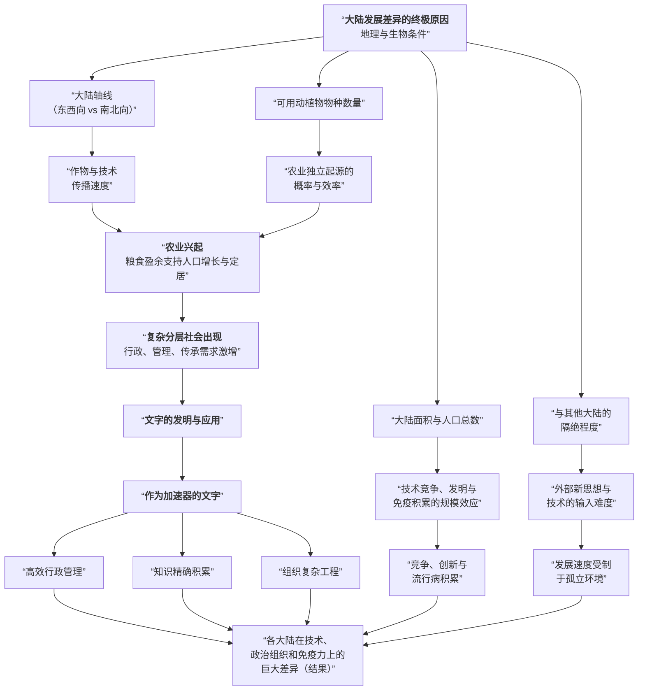

## 前言

阅读西方哲学史时，我发现我在阅读上的两个严重的问题：过目便忘，以及无法复述。当我读完忘了放书签，下一次拿起来阅读的时候，有好几次过了好久才猛然发觉，刚刚阅读的这些我上一次已经看过了。当我想和别人分享书中的内容的时候，又发现我知识的破碎和表达能力的欠缺。我决心做些改变，让我能够更好的理解和表达，我准备再阅读完一本书之后，写一篇文章来做个总结。

在此之前，我也写过哲学和经济学方面的一些文章，但问题有二。一是为了写文章，而会单独对我想表述的部分进行重读，以至于我写文章像是开卷考；二是我常用AI协助修饰和总结，虽然成品更能令我满意，但我在过程中的成长也少了许多。我思考再三，我能接受我的文章有内容上的瑕疵和文笔上的不流畅，而且我更期望我能系统的总结知识，能够独立的做好表达和输出，那么我应该不依靠任何AI和书本的协助，独立完成我的写作。内容不完整和文笔不流畅的问题，我完全可以在独立完成的文章的基础上，做二次编辑呢。

我上一本阅读的书是戴蒙德的《枪炮，细菌与钢铁》，这篇文章就由此出发吧。

---

## 总结

这本书是从几个问题开始的，问题不是作者提出的，是作者在新几内亚做鸟类研究时，一个叫亚力的朋友问的，问题是“**为什么是白人创造了那么多的货物，而黑人却几乎没什么创造**“。如果我们对这个问题进行拆解，会出现这几个问题：
 - 在不同的大陆上，为什么人类的发展速度差异巨大？
 - 为什么在近代，是欧洲人在全世界殖民？而不是非洲人亚洲人或者美洲人？

---

## 人类的发展差异很大吗？

作者没有直接回答这个问题，而是讲了一些历史，先解释：人类的发展速度差异真的很大吗？作者举了欧洲人殖民美洲的故事。

1532年，皮萨罗登陆南美洲，在卡哈马卡以200人兵力俘虏了印加帝国的皇帝，直接导致了印加帝国的瓦解。当时的印加帝国既已被称之为帝国，实力肯定不容小觑，按书上的介绍，当时印加帝国的兵力可能在八万上下，按比例计算，西班牙人一个人需要面对400个印加士兵，西班牙人简直没有胜算。但历史终究还是没能站在印加帝国这一边 ——仅一个照面，他们就被怪物般的马匹，闪电般的火绳枪吓破了胆，四散奔逃，死伤无数。皇帝被虏，在交出世上

而巴拿马地峡另一边的中美洲文明——阿兹特克帝国，甚至在欧洲人的脚步还没跨入帝国的版图时，已经悄然分崩离析，这次的主角不是领先的技术，而是“领先的”细菌。在天花、流感等病毒的攻击下，阿兹特克帝国的皇帝和一众大臣接连丧命。没过多久，这个可怜的帝国中50%~90%的人口都被灭绝，当欧洲人进入这片土地的时候，只见满目疮痍。

直到21世纪的今天，2025年，世界上还有一些地区生活着狩猎采集部落，真是令人惊讶。

---

## 导致发展差异的终极因是什么？

几个例子下来，我们对人类发展的差异之大已经有所概念了，于是作者开始往前推演，分析导致发展差异的终极因是什么？
——**地理因素**。

### 地理因素影响农耕和畜牧的发展

不同的地理环境——纬度、气候、地形、破碎化程度、大小、海拔等等，会提供不同的气候条件，进而使得动植物在不同气候条件下的演化路线变得天差地别，最终会发展出截然不同的生态多样性。
不同大陆的大小也不一样，比如

生态多样性越强，当地的部落就有更多可选择的植物和大型哺乳动物来驯化。书中对动植物的驯化选择做了一些深入的研究和探索。

关于植物的驯化：
 - 植物驯化的起源很可能来自人类的厕所等居住地附近，这个地方土壤富含营养，而且接近住宅，人们除草也会优先保留这些能吃的作物。
 - 可供驯化的植物很少，要求如下：
	 - 可食用部分大、营养价值高、方便采集和加工——否则没有收益。
	 - 生产周期短，且种子没有休眠期，可以储存。
	 - 自花授粉，或者无性繁殖——不受劣质基因干扰，性状稳定。
 - 几乎不存在有驯化潜力的动植物但狩猎采集部落的人没发现的情况。狩猎采集部落的人迫于生存压力，对当地的动植物的习性、作用等等都很了解，可以说是当地的百科全书。我认为有一部分原因是原始的生存环境会促使他们还进行物竞天择的演化，反观农业社会，智力、肢体有缺陷的人都可以活下去传播后代。
 - 从狩猎采集部落到农耕社会的转变不是一蹴而就的，会经历很长一段时间农耕和狩猎采集并存的状态。狩猎采集也可能定居，这就给发展农耕提供了基础条件。在不定居的狩猎采集部落来说，也有可能会做到播种后离开，收获期再回来的状态。

关于动物的驯化：
 - 能驯化的动物都是相似的，不能驯化的动物各有各的不幸——动物的驯化遵循安娜卡列尼娜原则。
 - 对人类来说，只有大型哺乳动物的驯化才会对发展大有裨益。大型哺乳动物驯化后不止能提供富含蛋白质的肉，还能协助人类运输、耕地等等，提高农作的效率。
 - 大型哺乳动物的生物多样性在不同大陆的差异比之植物更大，譬如美洲和澳洲在早期人类登陆后，大型哺乳类动物迅速灭绝。

农作物和牲畜帮助人们在单位面积上产出更多食物，由此导致：
- 充足的食物会激发更多的人口。
- 更多的人口和充足的食物，可以供养一些不事农作的职位，比如手工艺人、匠人、官吏等等，出现影响世界的天才人物的概率也会更大。
- 专业的人员能做出更专业的技术和改良，反过来可以提高耕作效率，造成积极的循环。
- 密集的人口，可以兼并周围没有农耕的狩猎采集部落，反而让人口更多。
- 密集的人口，同和人类朝夕相处的牲畜一起，会培养出很多致命的病毒，通过几百几千年和共同进化，农耕社会明显会有更高的”毒抗“，而且也能不经意间，对毒抗低的部落使用病毒攻击。

通过一些原始部落接触到农耕之后迅速学习采用的例子来看，他们没有发展农耕不是因为他们不愿意，而是没有条件。现代的农业研究也发现，世界范围内适合驯化的动植物都已经被驯化，没有被驯化的在现代技术下都很难被驯化。
所以我们可以得出结论——**地理因素影响生态多样性，生态多样性提供给人类得天独厚的优秀“生物包”，而农作物和畜牧是社会和技术的发展的基础。**

### 地理因素影响作物和技术的传播

地形的促进作用：
 - **大陆的轴向**，这是最容易被忽略的，但往往也是最重要的因素。欧亚大陆是东西走向，这就保证作物在传播的路上遇到的几乎都是相似的气候带，所以不需要适应周期。
 - 沿河和沿海地区，能发展出高效率的水路运输。

地形的阻隔作用：
 - 山脉的隔离，比如安迪斯山脉阻挡了美洲骆驼和马铃薯想亚马孙平原的传播。
 - 沙漠和裂谷。例如撒哈拉沙漠阻挡了北非的小麦、大麦往南非传播。
 - 岛屿。

类似的，技术的传播也仰仗于地形。

---

## 还有哪些其他的关键因素

### 文字

农耕的发展会催化文字的出现（也有概率因素），文字一经出现，就会通过其马太效应迅速催化社会和技术的快速发展。

> 马太效应来自《马太福音》的一则寓言——“因为凡有的，还要加给他，叫他有余；没有的，连他所有的也要夺过来”

文字的诞生作用无限，总结一下：
 - 突破了人脑的记忆限制。人脑是有限制的，有了文字，只要随身携带书籍，就可以保持知识的长久性和一致性。
 - 加速知识的传播，提高传播的广度。相比于口授的局限性，知识能通过文字进行快速传播。尤其在印刷术的普及之后，例如皮萨罗俘虏印加帝国皇帝，索要天价赎金的事件，不出数月就通过随行人员的文章传遍了整个欧洲，引起无数追随和效仿者。

### 政治与流通性

农耕的发展催生了中央集权的国家机器，能更好的整合社会资源去用于大型工程和研究。也能提供更专业的军队和技术。
而政治也有一些弊端，比如中国和欧洲都有很好的技术背景和技术积累，为什么最终是欧洲发展最快呢？这是因为中国的权利太过集中，对先进的技术、思想都有一票否决权。十五世纪初郑和的船队在规模和技术上远远超过了半个世纪后的哥伦布船队，但明政府一纸禁海令就把积累的航海经验技术和领先的机会全部扼杀。反观欧洲在14~16世纪及其开放，一个崭新的对发展有利的技术在一个国家不受重视，可以去其他国家都碰碰运气，只要有一个国家采纳，其他国家在观察之后也会很快跟进。

《全球通史》的作者斯塔夫利阿诺斯在书中有一个观点，可以和枪炮中的观点相互印证，他说人类在发展力一样的情况下，影响发展水平的是流通性。与邻近文明的技术交流/货物运输都属于流通性的范畴，中国始自明清的闭关锁国主动降低了流通性，中国自此走向下坡路，而与此同时的欧洲则开放的多，两个文明的摇篮于是在这里交叉路过。

---

## 我的感想

一个充满了好奇心的新几内亚人，遇到了一个充满求知欲和探索心的科学家，于是诞生了这本书。
只要初涉历史，相信大家对“为什么不同地区发展不一样”的问题都会有所疑惑，但关注的人却廖廖。大多数人对出生便注定的东西的态度往往是接受和忍受，我出生在江苏无锡的一个乡下地区，我家在村里算是最穷的那一批，从小到大我身边没有听到过一个“为什么我们家比别人家穷”，“为什么我们这里比无锡市里发展差那么多”，“为什么隔壁苏州发展比我们好这么多”这类的言论，更别说全球视角的眼光。很感谢亚力能够提出这么一个宏大的问题，也感谢戴蒙德能写出这本书，我认为这不仅是人类的财富，也是一种知识的启蒙。

阅读此书时，我无时无刻不在感慨，如果我能像戴蒙德一样对一切充满好奇，保持极高的探索欲和极强的行动力，那么我的人生将会多么丰富多彩呀。我认为我正在努力扩展我的知识边界，从哲学/经济学/物理数学，到历史/社会，我希望我之后也能有足够的知识储备来“鉴赏”世界的参差百态——罗素先生说“参差百态乃幸福的本源”，知识和探索求知，我认为是人生在世能接触到的最大的参差百态。

我也很惊讶于作者得出的结论：世界发展的参差居然很大程度上是地理因素的影响。设想一下，如果有机会让我再回到一万年前，以上帝视角来猜测哪个大陆最终发展水平会更高并开启全球化，我肯定毫不犹豫的选择欧亚大陆。

斯塔夫利阿诺斯说，每个时代都要重写历史，因为每个时代的面临的问题都不一样，需要从不同的角度看待历史得到新问题的新答案。这本书我认为某种程度上也可以视作一种历史书，是站在发展水平/发展能力的角度看待的历史。如何提高发展水平（包括可持续发展）在21世纪的今天，毋庸置疑是TOP级别的问题，我相信这个问题在将来也将一直是TOP级别的问题，这本书将永垂不朽。

---

## 补充

### 语言学在研究中的作用

语言学很有意思，作者在文章中大段篇幅讲了很多技术、农业、部族的发展传播的研究，都是仰仗语言学的辅助。
比如已知语言的传播路径，A->B，A->C，农作物X在ABC三个地区都一样，但农作物Y在BC都不一样，就可以推断出农作物X是人口迁移前就驯化的，而农作物Y是后面才驯化的。
比如非洲南部被说班图语的农民族群主导，怎么判断当地的农业是农民的迁徙，即当地的农民不是原住民，还是农业技术的传播，当地的农民就是原住民呢？语言学家通过整个非洲几百个不同的班图语中的同源词的分析，扩展出了一个清晰的谱系树（发音是有省力原则的，发展会往省力方向走，所以很容易推断一个两个不同音的词哪个是更古老的哪个是更新的）。

### 原因链图标化

——来自AI

